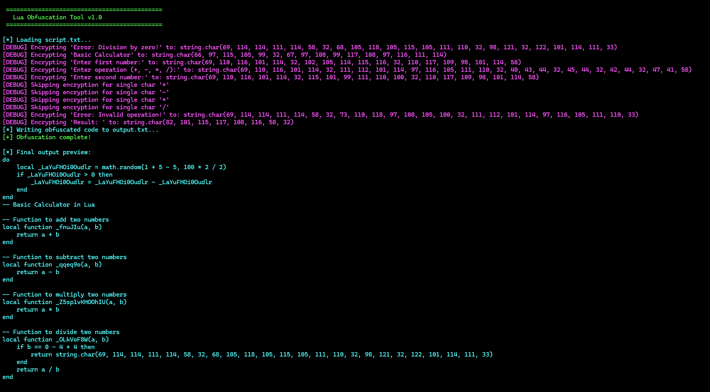

# Lua Obfuscation Tool

A PowerShell script that obfuscates Lua code to make it harder to read while preserving functionality. Built with a hacker-themed UI for style.  
**Note:** This is a Work in Progress (WIP) and not fully functional yet—some features may have bugs or limitations.

## Screenshot
{ width=500 }

## Features
- **Variable Renaming**: Randomizes variable names.
- **Function Renaming**: Renames user-defined functions (preserves Lua built-ins).
- **String Encryption**: Converts strings to `string.char()` calls (skips single-character operators).
- **Number Obfuscation**: Replaces numbers with equivalent math expressions.
- **Junk Code**: Adds harmless code blocks for extra confusion.

## Usage
1. Place your Lua script as `script.txt` in the same directory.
2. Run the PowerShell script: `powershell -File obfuscator.ps1`.
3. Find the obfuscated code in `output.txt`.

### Example
**Input (`script.txt`):**
```lua
local function add(a, b)
    return a + b
end
print("Result: " .. add(5, 3))
